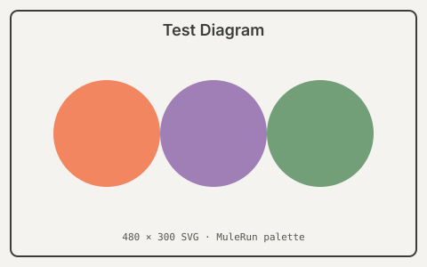

# Edge Cases

A torture test for tables, images, deep heading nesting, long code lines,
overflowing content, and nested lists / blockquotes.

## Images

### Local SVG



### Local SVG via `<Figure>` with caption

<Figure
  src="./assets/diagram.svg"
  caption="Three overlapping circles in the QwenWork palette"
  credit="QwenWork Design"
/>

## Long & wide table

| #  | Project       | Owner          | Status      | Quarter | Budget (USD) | Region | Stakeholders | Risk | Health |
| -: | ------------- | -------------- | ----------- | ------- | -----------: | ------ | -----------: | :---: | :----: |
|  1 | Atlas         | Hsu, Marian    | In progress | Q1 2026 |      120,000 | APAC   |            7 | Low   |   🟢   |
|  2 | Bramble       | Okafor, Adaeze | Blocked     | Q2 2026 |       45,500 | EMEA   |            3 | High  |   🔴   |
|  3 | Cinder        | Volkov, Pyotr  | Planning    | Q3 2026 |      210,000 | EMEA   |           12 | Med   |   🟡   |
|  4 | Dune          | Reyes, Camila  | In progress | Q2 2026 |       88,200 | AMER   |            5 | Low   |   🟢   |
|  5 | Ember         | Tan, Wei       | Done        | Q4 2025 |       60,000 | APAC   |            4 | —     |   ✅   |
|  6 | Forge         | Bauer, Ingrid  | In progress | Q1 2026 |      175,500 | EMEA   |            9 | Med   |   🟡   |
|  7 | Glade         | Bandyopadhyay, A. | Planning | Q3 2026 |       30,000 | APAC   |            2 | Low   |   🟢   |
|  8 | Hearth        | Costa, Inês    | Blocked     | Q2 2026 |       95,000 | AMER   |            6 | High  |   🔴   |
|  9 | Indigo        | Park, Min-jun  | In progress | Q1 2026 |      140,000 | APAC   |            8 | Med   |   🟡   |
| 10 | Juniper       | El-Sayed, Yara | Done        | Q4 2025 |       55,200 | EMEA   |            3 | —     |   ✅   |
| 11 | Kestrel       | Nilsson, Olov  | In progress | Q1 2026 |      102,000 | EMEA   |            5 | Low   |   🟢   |
| 12 | Lantern       | Patel, Anaya   | Planning    | Q3 2026 |       72,000 | APAC   |            4 | Med   |   🟡   |

## Deep heading nesting

# H1 — Level 1
## H2 — Level 2
### H3 — Level 3
#### H4 — Level 4
##### H5 — Level 5
###### H6 — Level 6

Body paragraph after the deepest heading, to confirm rhythm continues correctly.

## Long lines & overflow

Inline very long token: `supercalifragilisticexpialidocious_my_extremely_long_identifier_name_that_should_break_or_wrap_gracefully_inside_a_table_or_paragraph`.

A code line longer than the page width:

```python
def very_long_function_name_with_many_arguments(argument_one: str, argument_two: int, argument_three: list[dict[str, str]], argument_four: bool = False) -> tuple[str, int, list[dict[str, str]]]:
    return (argument_one, argument_two, argument_three)
```

Code block with blank lines (line-spacing check):

```python
import math


def area(r: float) -> float:
    """Area of a circle."""

    return math.pi * r * r


def circumference(r: float) -> float:
    """Circumference of a circle."""

    return 2 * math.pi * r
```

## Long blockquote with nested elements

> # Heading inside a blockquote
>
> Paragraph one with **bold** and *italic* and `code`. Multiple sentences to
> see how wrapping behaves. Vivamus tortor justo, vehicula sit amet enim quis,
> dignissim suscipit elit. Quisque dictum vehicula massa, in feugiat lectus
> mattis sed.
>
> - Nested bullet a
> - Nested bullet b
>   - Deeper b.1
>
> > A nested blockquote inside the outer blockquote.
> >
> > With its own paragraph.
>
> Final paragraph in the outer quote.

## Mixed nested lists

1. Top item
   - Sub bullet
     1. Sub-sub ordered
        - Sub-sub-sub bullet
          - Even deeper
   - Another sub bullet
2. Second top item
   - With `inline code` and a [link](https://example.com)
   - And another bullet
3. Third top item with a paragraph break

   This indented paragraph still belongs to item 3 — checks loose list rendering.

   ```bash
   echo "code blocks inside list items should keep their frame"
   ```

   - and a nested bullet after the code block
4. Fourth item

## Callouts back-to-back

<Callout type="note">First callout</Callout>
<Callout type="tip">Second callout</Callout>
<Callout type="warning">Third callout</Callout>
<Callout type="danger">Fourth callout</Callout>

## Explicit landscape page

The `<Landscape>` component forces its contents onto a sideways page —
useful for wide diagrams that need horizontal room.

<Landscape caption="A wide flowchart that benefits from landscape orientation">
<Mermaid>{`flowchart LR
  Brief --> Research --> Synthesis --> Outline --> Draft --> Review --> Verify --> Polish --> Publish --> Distribute
  Review -.->|rework| Draft
  Verify -.->|fail| Research`}</Mermaid>
</Landscape>

## Final paragraph

End of edge-cases document.
